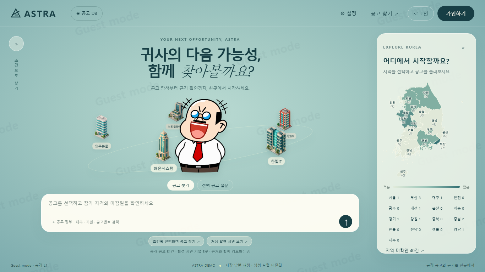

# ASTRA Dashboard — V3 UI 배포본 (2026-09-18)

Windows: `START_ASTRA_V3.cmd` 더블클릭 → 처음 한 번 시연 데이터가 자동 설치되고 브라우저가 열립니다. 실행 창은 켜둡니다.
macOS/Linux: `./start_astra_v3.sh`
필요: Python 3.10 이상. 자세한 내용은 `실행방법.pdf`.

# ASTRA Dashboard — V2 작업 미리보기

현재 브랜치는 `codex/ui-v2`입니다. V1 태그와 Release는 그대로 보존됩니다. V2 변경·계정·검증·제한 사항은 [구현 보고서](docs/V2-구현검증보고서.md)를 확인하세요. 기존 데이터 설치 절차는 아래와 같습니다.

# ASTRA Dashboard — V1

기업 담당자의 공고 탐색과 연구원의 AI 답변·근거 검토를 위한 PC 시연 대시보드입니다. **현재 제품 버전은 v1.0.0**, 구현 기준 문서는 **제작 프롬프트 1.2**입니다.



## 실행만 하고 싶다면

[Releases](https://github.com/jihoon0915-gif/astra-dashboard/releases)에서 **ASTRA-dashboard-v1.2-team-Windows-x64.zip**을 받으세요. 기존 배포 파일명을 그대로 보존했으며 이 파일이 제품 **V1**입니다.

Windows 10/11 64비트에서 압축을 모두 풀고 **START_ASTRA.cmd**를 실행하면 됩니다. Python·Node·생성 모델을 별도로 설치할 필요가 없습니다. 실행 창을 열어두세요. 폴더의 먼저읽기.txt에 계정표가 있습니다.

## 소스를 수정하려면

Python 3.10 이상을 준비하고 저장소를 복제합니다. 비공개 저장소이므로 저장소 접근 권한이 필요합니다.

```bash
git clone https://github.com/jihoon0915-gif/astra-dashboard.git
cd astra-dashboard
gh release download v1.0.0 --repo jihoon0915-gif/astra-dashboard --pattern ASTRA-demo-data-v1.zip --dir downloads
python setup_data.py
python launch.py
```

GitHub CLI가 없다면 Release 페이지에서 `ASTRA-demo-data-v1.zip`을 내려받아 다음처럼 지정할 수 있습니다.

```bash
python setup_data.py "다운로드한 ZIP의 경로"
```

Mac/Linux에서는 명령의 `python`을 설치 환경에 따라 `python3`으로 바꾸세요. 별도 pip 패키지는 필요 없습니다. 데이터 해시가 일치해야 설치되며 이미 다른 데이터가 있으면 덮어쓰지 않습니다.

데이터는 최초 준비 때만 받으면 됩니다. 이후 UI 수정은 `git pull`로 공유하고, 데이터 버전 변경 시 `data-version.json`에 지정된 새 파일을 받습니다. GitHub가 자동 생성하는 **Source code.zip**에는 데이터와 Windows 런타임이 없으므로 즉시 실행용 ZIP과 구분하세요.

## 로그인

모든 시연 비밀번호는 **000000**입니다.

| 회사 코드 | 회사 | L2 사번 | L2·L3 사번 |
|---|---|---|---|
| C01 | 가상 한빛IT | C01-1001 | C01-2001 |
| C02 | 가상 해온시스템 | C02-1001 | C02-2001 |
| C03 | 가상 인우블록 | C03-1001 | C03-2001 |
| C04 | 가상 누리클라우드 | C04-1001 | C04-2001 |
| C05 | 가상 새온에너지SW | C05-1001 | C05-2001 |

별도 연구원 화면은 설정에서 진입합니다. 최초 실행 시 생성되는 `private/researcher.key`를 사용합니다. 이 키는 Git에 올리지 않습니다. 로컬 파일을 소유한 개발자에게 파일 자체를 숨기는 보안 모델은 아니며, 서버 API의 계정별 권한을 시연합니다.

## 협업과 버전

1. `main`은 검토한 기준 코드입니다.
2. 작업 시작 전 최신 `main`을 받고 `ui/login` 같은 작업 브랜치를 만듭니다.
3. 수정·검증 후 커밋하고 Pull Request로 변경 내용을 공유합니다.
4. 검토 후 `main`에 합치고 팀원이 최신 변경을 받습니다.
5. 확정 시점에는 새 태그와 Release를 만듭니다. V1의 `v1.0.0` 태그와 실행 ZIP을 덮어쓰지 않습니다.

```bash
git switch main
git pull --ff-only
git switch -c ui/login
# 수정 및 검증
git add public/app.css public/app.js
git commit -m "Improve login layout"
git push -u origin ui/login
```

다음 큰 검토본은 `v2.0.0`, 작은 V1 수정은 `v1.0.1`처럼 관리할 수 있습니다. 실제 배포본에는 그 버전의 소스·데이터·런타임을 함께 묶어 옛 버전도 재현 가능하게 보관합니다. GitHub Desktop을 사용해도 같은 방식으로 작업할 수 있습니다.

## 구조

- `public/`: HTML·CSS·JS·캐릭터·지도. UI 수정의 중심입니다.
- `server.py`: 실제 로그인, 회사·등급별 접근 제어, 자료 및 재생 API.
- `launch.py`: 로컬 서버·브라우저 시작. 기본 포트 8770, 사용 중이면 다음 포트 선택.
- `setup_data.py`, `data-version.json`: Release 데이터 준비·SHA-256 확인.
- `legacy-source/`: 이전 코드 보존. `project-docs/`의 검수 자료는 데이터 패키지로 제공됩니다.
- `private/`: 다운로드한 데이터와 PC별 키. Git 추적에서 제외됩니다.
- `docs/`: 화면 캡처와 기존 구현 검증 보고서. 보고서의 로컬 경로는 제작 당시 기록입니다.

## 검증

데이터 준비 후:

```bash
python -m unittest test_server -v
```

회사 10개 계정 조합, 문서별 회사·L2/L3 차단, 게스트·로그아웃, 원본 답변과 근거 대응, 소스 보존을 검사합니다. 브라우저 시연 검증 기록은 `evidence/`에 있습니다. 기존 파일 82개 중 재사용할 필요가 없는 Python 캐시 7개를 제외한 75개 원본 파일의 해시를 보관합니다.

## 현재 범위와 출처

생성 모델 없이 저장 답변을 재생합니다. 새 자유 질문 생성과 첨부파일 파싱·분석은 미연결입니다. 공개 공고 51건, 회사 문서 41개, 회사별 근거에 대응되는 L2/L3 저장 사례를 사용합니다. 선별 100건의 85%는 사후 구성 비율이며 모델 전체 정확도가 아닙니다.

지도는 [southkorea-maps](https://github.com/southkorea/southkorea-maps)의 KOSTAT 2013 경계이며 현재 행정 경계를 보증하지 않습니다. 실행 ZIP에 포함된 Python 3.13.15의 라이선스와 출처는 해당 ZIP의 `THIRD_PARTY.md`, `runtime/LICENSE.txt`에 있습니다.
