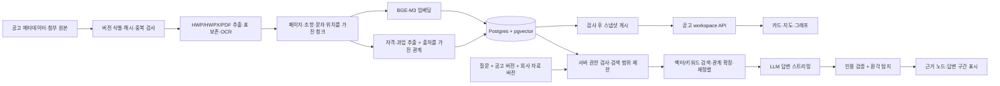

# ASTRA: 목업에서 실제 나라장터 RAG로 전환

현재 현실 지도 엔진은 **MapLibre + OpenFreeMap**입니다. 아래 구조는 Mapbox로 바꾸더라도 데이터 계층을 유지합니다. 이 문서는 전환 설계 및 코드 골격이며, 현재 DB·LLM·로그인 서버에 연결 완료된 상태가 아닙니다. 첨부한 JS도 기존 화면에 자동 적용하지 않았습니다.

핵심 결정: 현재 vanilla JS를 유지하고 **REST + POST NDJSON 스트리밍**, **FastAPI + PostgreSQL/pgvector + 파일 저장소**를 먼저 사용합니다. React/GraphQL/Neo4j로 동시에 옮길 필요는 없습니다. 그래프 UI를 그리는 것과 GraphRAG 검색을 구현하는 것은 별개입니다.

## 1. 전체 흐름



공고 클릭은 DB에서 게시된 그래프를 읽는 동작입니다. 클릭할 때마다 원문 전체를 LLM으로 재분석하면 느리고 결과도 달라집니다. 추출·임베딩은 적재 단계에서, 질의별 근거 선택은 검색 단계에서 수행합니다.

## 2. 기존 파일을 어떻게 나눌까

```text
dist/
  app.js                     # 조립만: source, controller, mapAdapter, views
  config.js                  # DATA_MODE=mock|live; API_BASE=/api/v1
  api/live-source.mjs         # 첨부 api.mjs를 옮김
  api/mock-source.mjs         # 같은 DataSource 계약을 구현
  state/workspace.mjs         # 첨부 controller.mjs를 옮김
  views/notice-list.mjs       # categories, bid-list
  views/graph.mjs             # 노드/엣지 레이아웃 + 강조 상태
  views/qa-dock.mjs           # 질문·스트리밍·중단·재시도
  views/source-drawer.mjs     # 인증된 문서/PDF·구간 표시
  map/reality-adapter.mjs     # focus(location), cancel(), marker callback
  twin.js                    # 합성 가상 세계는 계속 독립 유지
backend/
  app/main.py
  app/api/notices.py          # 목록·workspace
  app/api/answers.py          # POST stream
  app/api/documents.py        # 권한 검사 후 PDF/청크 제공
  app/auth.py                # 실제 세션 → 사용자/조직/역할
  app/repositories/           # SQL 및 승인된 범위 조회
  app/services/retrieval.py
  app/services/generation.py
  app/services/detection.py
  app/services/citations.py
  workers/ingest.py
  migrations/
```

현재 `bids.js`, `chunks()`, `renderDirectory()`, `drawGraph()`, `answer()`가 데이터와 UI를 같이 만들고 있습니다. `bids.js/chunks()`는 mock-source로 옮기고, `drawGraph()`는 전달받은 `{nodes,edges}`만 그리게 변경합니다. 실제 모드에서 `twin-data.js`나 `dryrun` 결과를 대체 답변으로 사용하지 않습니다. API 오류 시 '실제 자료 조회 실패'를 표시합니다.

첨부 `contracts.ts`는 계약 문서, `api.mjs`와 `controller.mjs`는 프레임워크 독립 코드 골격입니다. TypeScript 파일을 현재 HTML이 직접 실행하는 것은 아닙니다.

## 3. 수집·DB 설계

| 테이블 | 핵심 키·필드 |
|---|---|
| notices | id, 공고번호, 공고차수, category, agency_id |
| notice_versions | id, notice_id, 원본 메타 JSON, 상태, 게시/정정 시각, supersedes_id |
| documents | id, notice_id, 원본 이름, 원본 출처 URL |
| document_versions | id, document_id, SHA256, 저장경로, MIME, parser_version, extraction_status |
| notice_document_versions | notice_version_id, document_version_id; 정정본이 어떤 첨부를 참조하는지 고정 |
| chunks | id, document_version_id, text, page, section, text_start/end, bbox, tokenizer_version |
| chunk_embeddings | chunk_id, embedding_model_version, vector(1024); BGE-M3 dense 기준 |
| extracted_entities | id, kind, typed_value, unit, conditions, source_chunk_id, quote_start/end, review_status |
| graph_edges | id, source_id, target_id, relation, source_chunk_id, extraction_method |
| published_snapshots | id, notice_version_id, index_version, graph_version, status |
| snapshot_chunks | snapshot_id, chunk_id; 게시된 문서 집합 고정 |
| company_profile_versions | id, tenant_id, 실적/등록/인증 구조화 값, 증빙 document_version_id |
| access_grants | principal/tenant, resource_id, permissions; 기본 거부 |
| answer_runs | request_id, user_id, snapshot_id, 회사 버전, 검색 청크, 모델/프롬프트/임계값 버전, 완료 상태 |

12종 명칭은 **문서 태그**로 저장합니다. `제안요청`과 `RFP`는 같은 문서일 수 있고, 한 파일이 여러 태그를 가질 수 있습니다. 파일이 12개씩 존재한다고 가정하지 않습니다. PDF/HWP가 같은 제목이어도 내용·버전을 확인하기 전 삭제하지 않습니다.

수집 재실행은 `(공고번호, 공고차수, 원본 식별자, SHA256)`로 멱등 처리합니다. 파싱 실패/OCR 저품질/비어 있는 문서는 격리하고, 처리 중 자료를 Live 검색에 섞지 않습니다. 정정공고는 새 버전으로 게시하고 이전 버전을 보존합니다. 취소·마감 상태도 카드에 표시합니다.

페이지와 조항이 없는 HWP 추출 결과에 임의 페이지 번호를 만들지 않습니다. 정규화 텍스트와 원문 페이지·bbox 대응표를 보존해야 원문 하이라이트가 가능합니다. 표는 단위·행열 제목을 함께 청크에 넣습니다. 자격의 AND/OR, 공동수급 예외, 기준일을 수치 하나로 축약하지 않습니다.

## 4. API 목록과 한 번의 선택

| API | 역할 |
|---|---|
| GET /api/v1/me | 서버가 확인한 사용자·조직·권한 |
| GET /api/v1/notices?month=2026-05&category=service&cursor=… | 목록, cursor pagination |
| GET /api/v1/notices/{id}/workspace | 공고 버전·검증된 위치·그래프를 동일 snapshot으로 반환 |
| GET /api/v1/graphs/{snapshot_id}?cursor=… | 큰 그래프 추가 로딩 |
| GET /api/v1/chunks/{id} | 권한 있는 원문 청크 및 bbox |
| GET /api/v1/document-versions/{id}/content | 인증 후 PDF/원본; Range 요청 지원 권장 |
| POST /api/v1/answers/stream | NDJSON 이벤트 스트리밍 |

```text
카드 클릭(id)
  → 이전 workspace fetch·답변 stream·camera 취소
  → 선택 세대번호 증가, 오래된 화면 근거 제거
  → workspace 조회(서버 권한 검사)
  → 세대번호가 최신이면 공고/그래프/위치를 원자적으로 커밋
  → verified execution_site면 flyTo
  → 위치 미확인/기관 주소만 있으면 위치 확인 필요 표시
```

공고 A 클릭 직후 B를 눌러 A 응답이 늦게 와도 B 화면을 덮으면 안 됩니다. 첨부 controller는 AbortController와 세대번호를 함께 검사합니다. 게시 스냅샷이 바뀌면 서버는 409로 새로고침을 요구하며 답변 도중 버전을 조용히 바꾸지 않습니다.

좌표는 `execution_site / agency_address / regional_anchor`로 구분합니다. 실제 작업 장소가 여러 곳이면 sites 배열로 확장하고 사용자가 선택하게 합니다. 실제 모드에서 가상 시연 좌표를 채워 넣지 않습니다.

## 5. 바로 렌더링 가능한 그래프 JSON

아래는 스키마 설명용 합성 예시입니다. 노드의 ID는 문자열 라벨에서 생성하지 않고 DB의 영속 ID를 사용합니다.

```json
{
  "schema_version": "1",
  "snapshot_id": "snap-42",
  "notice": {
    "id": "notice-17", "version_id": "nv-3",
    "title": "합성 제조 데이터 플랫폼 구축", "agency_name": "예시 발주기관",
    "category": "service", "budget_krw": 1450000000,
    "deadline": "2026-05-28T14:00:00+09:00", "status": "closed"
  },
  "location": null,
  "company_profile": null,
  "graph": {
    "nodes": [
      {"id":"notice-17","kind":"notice","label":"제조 데이터 플랫폼","source_refs":[],"extraction":"metadata","review_status":"verified"},
      {"id":"agency-2","kind":"agency","label":"예시 발주기관","source_refs":[],"extraction":"metadata","review_status":"verified"},
      {"id":"dv-8","kind":"document","label":"RFP · 정정본","source_refs":[],"extraction":"metadata","review_status":"verified"},
      {"id":"chunk-24","kind":"clause","label":"RFP 제4조 · 참가 자격","source_refs":[{"document_version_id":"dv-8","chunk_id":"chunk-24","page":3,"section":"제4조","quote":"실적 10억 원 이상","text_start":0,"text_end":11}],"extraction":"rule","review_status":"unreviewed"},
      {"id":"q-9","kind":"qualification","label":"유사 실적 기준","source_refs":[{"document_version_id":"dv-8","chunk_id":"chunk-24","page":3,"section":"제4조","quote":"실적 10억 원 이상","text_start":0,"text_end":11}],"extraction":"model","review_status":"unreviewed"}
    ],
    "edges": [
      {"id":"e1","source":"notice-17","target":"agency-2","relation":"ISSUED_BY","source_refs":[]},
      {"id":"e2","source":"notice-17","target":"dv-8","relation":"HAS_DOCUMENT","source_refs":[]},
      {"id":"e3","source":"dv-8","target":"chunk-24","relation":"HAS_CLAUSE","source_refs":[]},
      {"id":"e4","source":"q-9","target":"chunk-24","relation":"SUPPORTED_BY","source_refs":[]}
    ],
    "truncated": false, "next_cursor": null
  }
}
```

실제 구현에서는 의미 관계인 e4에도 원문 source_refs를 붙입니다. 메타데이터 관계와 LLM이 추정한 관계는 화면에서 구분합니다.

초기 그래프는 예를 들어 최대 200개 노드로 제한하고, 잘린 결과는 truncated와 cursor로 알립니다. 검색 근거가 현재 그래프에 없으면 retrieval 이벤트로 추가 노드·엣지를 보냅니다. 프론트는 ID로 병합합니다. 서버는 권한 밖 노드로 연결되는 엣지도 제거해야 합니다.

그래프의 배치 좌표 x/y는 화면에서 계산하며 지도 경위도와 구분합니다. node.id별 배치를 유지해 근거 추가 시 그래프 전체가 튀지 않게 합니다.

## 6. Q&A 도크와 이벤트 계약

```html
<form id="qa-form" aria-label="선택 공고에 질문">
  <label for="qa-input">선택한 공고에 질문</label>
  <textarea id="qa-input" required maxlength="2000"
    placeholder="우리 회사 실적으로 참가 자격을 충족하나요?"></textarea>
  <button type="submit">질문 보내기</button>
  <button type="button" id="qa-stop">응답 중단</button>
</form>
<p id="qa-stage" role="status"></p>
<div id="qa-answer"></div>
```

```js
form.addEventListener('submit', e => {
  e.preventDefault();
  controller.ask(input.value);
});
stopButton.addEventListener('click', () => controller.cancel());
// 임의 HTML을 삽입하지 않습니다. Markdown이 필요하면 검증된 sanitizer를 사용합니다.
function setAnswer(text) { answerElement.textContent = text; }
function highlightNodes(ids, status) {
  for (const node of graphElement.querySelectorAll('[data-node-id]')) {
    node.classList.toggle('cited', ids.includes(node.dataset.nodeId));
    node.dataset.citationStatus = status;
  }
}
```

모바일에서는 지도 하단 전체를 가리지 않는 접이식 도크, 데스크톱에서는 좌우 패널 사이 하단에 배치합니다. IME 조합 중 Enter를 전송으로 처리하지 않고 기본은 버튼/ Ctrl+Enter를 사용합니다. 모든 토큰을 aria-live로 읽게 하지 말고 상태·완료만 알립니다.

이벤트는 **한 줄에 JSON 하나**, 각 줄 끝에 `\n`을 붙입니다. POST 본문이 필요하므로 EventSource 대신 fetch ReadableStream을 사용합니다. 청크 경계가 JSON 줄/한글 문자 경계와 일치한다고 가정하지 않습니다. 첨부 api.mjs가 분할과 TextDecoder를 처리합니다.

| 이벤트 | UI 동작 |
|---|---|
| retrieval | 검색한 청크/그래프 병합. '검색된 문서' 표시이며 아직 답변의 검증된 근거 아님 |
| delta | 응답 누적. '검증 전' 표시 |
| citation | 해당 노드 강조. candidate/verified 구분 |
| detection | 최종 답변 기준 환각 의심 구간 표시 |
| done | 최종 답변·검사 완료/불가 상태 확정 |
| error | 부분 답변을 미완료로 유지하고 재시도 제공 |

모든 이벤트에 request_id, seq, snapshot_id를 붙입니다. request_id는 서버가 인증된 사용자 범위에서 client_request_id와 연계해 돌려줍니다. 중복 요청은 사용자+ID로 처리하고 같은 ID의 질문 내용이 다르면 거부합니다. done 없이 연결 종료는 성공이 아닙니다.

## 7. FastAPI 스트림 라우트 골격

아래는 의존 서비스 인터페이스를 보여주는 코드입니다. `auth`, `repository`, `rag` 구현 없이 바로 실행되는 서버는 아닙니다.

```python
import asyncio, json
from fastapi import APIRouter, Depends, Request
from fastapi.responses import StreamingResponse

router = APIRouter()

@router.post('/answers/stream')
async def answer_stream(body: AskBody, request: Request,
                        user=Depends(require_session)):
    # HTTP 헤더 전송 전에 401/403/409를 결정합니다.
    scope = await repository.authorize_snapshot(
        user, body.notice_id, body.notice_version_id, body.snapshot_id,
        body.company_profile_version_id)
    seq = 0
    async def events():
        nonlocal seq
        try:
            async for payload in rag.run(scope, body.question):
                if await request.is_disconnected():
                    return
                yield json.dumps({
                    **payload, 'request_id': body.client_request_id,
                    'snapshot_id': body.snapshot_id, 'seq': seq
                }, ensure_ascii=False) + '\n'
                seq += 1
        except asyncio.CancelledError:
            raise
        except Exception:
            # 내부 문서/프롬프트/스택을 사용자에게 누출하지 않음
            yield json.dumps({'type':'error','code':'ANSWER_FAILED',
                'message':'답변 처리를 완료하지 못했습니다.', 'retryable':True,
                'request_id':body.client_request_id,
                'snapshot_id':body.snapshot_id,'seq':seq}, ensure_ascii=False)+'\n'
        finally:
            await rag.cancel_upstream(body.client_request_id)
    return StreamingResponse(events(), media_type='application/x-ndjson',
        headers={'Cache-Control':'no-store','X-Accel-Buffering':'no'})
```

LLM 대기가 길어도 취소를 처리하도록 upstream 타임아웃·disconnect 감시·동시요청 제한이 필요합니다. reverse proxy buffering도 꺼야 실제 스트리밍이 됩니다. 쿠키 세션을 쓰면 CSRF/Origin 검사와 SameSite 설정을 함께 적용합니다. 정적 프론트와 `/api`를 같은 origin에서 제공하면 배포가 단순합니다.

## 8. 실제 검색과 환각 탐지는 분리

1. 로그인에서 서버가 결정한 조직/권한 + 공고 snapshot + 회사 증빙 버전으로 검색 범위를 정합니다. 프론트 role 드롭다운/관리자 직행은 Live에서 제거합니다.
2. BGE-M3 **원본 임베딩 모델**로 질의를 인코딩하고 공고와 승인된 회사 증빙을 검색합니다. 기존 파인튜닝 BGE-M3 환각 탐지 가중치와 역할·모델 경로를 분리합니다.
3. 벡터 검색+키워드 후보를 합친 후 재정렬합니다. 예시 후보수40→근거6은 튜닝 시작값일 뿐입니다. 조항 인접/요건 SUPPORTED_BY 간선을 따라 1-hop 확장할 수 있으며 확장에도 같은 권한 필터를 적용합니다.
4. 질문 + 허용된 문서 + 회사 증빙을 LLM에 입력합니다. 회사 증빙이 없으면 '확인할 자료 부족'으로 답해야 합니다.
5. LLM의 인용 ID는 검색 결과 집합에 있는지 서버에서 확인합니다. 문서에 존재하는 인용과 그 문서가 실제로 주장을 뒷받침하는지는 별도 검증입니다.
6. 생성된 **최종 답변**과 실제 제공 컨텍스트를 탐지기에 넣습니다. 검증 중에는 답변을 정상으로 확정하지 않습니다. 인용 문서는 환각 탐지기가 자동으로 찾아주는 결과가 아니므로 별도 출처 대조가 필요합니다.

pgvector의 근사 인덱스는 필터 적용 시 후보가 부족해질 수 있습니다. 공고 단위 소규모 검색은 허용 청크 집합의 정확 검색으로 시작하고, 규모 증가 시 검색 recall·필터 동작을 검증합니다. 단순 UI 필터를 접근제어로 사용하지 않습니다.

## 9. 오프셋·캐시·권한에서 꼭 맞출 것

- 답변과 근거 오프셋은 Unicode code point 기준, 끝 제외로 통일합니다. JS `slice`는 UTF-16이므로 이모지가 있으면 다릅니다. `Array.from(text).slice(start,end).join('')`로 변환하거나 공통 매핑 함수를 사용합니다.
- detection의 answer_sha256을 UTF-8 최종 답변 해시와 대조한 뒤 구간을 적용합니다. Markdown 렌더 텍스트로 위치를 재계산하지 않습니다.
- 겹치는 span은 병합 규칙을 정하고 범위 밖/음수/NaN 확률을 거부합니다. 검증 응답 실패를 '환각 없음'으로 표시하지 않습니다.
- 캐시는 `사용자/조직의 권한 버전 + snapshot + 회사 증빙 버전 + 질문 + 모델/프롬프트 버전`으로 범위를 나눕니다. 로그아웃/권한 변경 시 비공개 캐시를 비웁니다.
- 문서 PDF·다운로드·인용 청크·그래프 노드·LLM 컨텍스트 모두 같은 권한 정책을 적용합니다. L2/L3 원본을 `dist/`에 넣지 않습니다. PDF 링크는 인증 라우트 또는 짧게 만료되는 URL로 제공합니다.
- DB RLS는 보조 방어로 사용할 수 있지만 DB 소유자/우회 권한 및 연결 풀의 사용자 컨텍스트를 검증해야 합니다. `doc_level <= user_level`만으로 타 회사 자료를 허용하면 안 됩니다.
- 문서 안의 지시문은 데이터입니다. 모델의 정책/권한을 바꾸거나 외부 도구를 실행할 근거로 사용하지 않습니다.

## 10. 단계별 완료 기준과 업무 배분

| 순서 | 담당 | 제출물·완료 기준 |
|---|---|---|
| 1 | 수집/데이터 | 5월 공고 10~20건의 원본 manifest, 버전·페이지 보존 청크, 파싱 오류 목록 |
| 2 | 백엔드 | DB migration + 목록/workspace/document API; 로그인 없는 비공개 요청은 거부 |
| 3 | 프론트 | DataSource 분리; A→B 빠른 선택 시 데이터/지도/답변이 뒤섞이지 않음 |
| 4 | RAG 담당 | 질문별 검색 근거·LLM 스트림·인용 ID 검증; 회사 증빙 없는 질문은 보류 |
| 5 | 모델 담당 | 탐지 입력 구성·임계값·최종 답변 span·모델 버전 기록 |
| 6 | 공동 평가 | 정정/취소/권한/단위/이모지/중단/근거누락 등 실패 사례 테스트 |

첫 완료 목표는 '모든 문서를 넣었다'가 아니라 **실제 공고 1건에서 질문→근거 원문→답변→의심 구간이 동일한 버전으로 이어지는 것**입니다. 그다음 10~20건으로 넓혀 검색 recall, 인용 정확도, 환각 클래스 P/R/F1, 첫 토큰 지연 및 전체 검증 지연을 측정합니다.

참고: [FastAPI StreamingResponse](https://fastapi.tiangolo.com/advanced/custom-response/), [pgvector 필터·검색](https://github.com/pgvector/pgvector), [PostgreSQL 행 권한 정책](https://www.postgresql.org/docs/current/ddl-rowsecurity.html).
